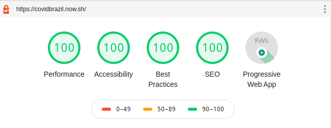

# Covidbrazil

Uma plataforma, que recebe, em tempo real, dados sobre casos epidemiológicos, tem o número de casos, mortes, recuperações, e informações novas sobre a doença. Com o objetivo de previnir o usuário.

- [PWA screenshots](https://github.com/joaopedroaats/covidbrazil/blob/master/README-SHOTS.md)

## APIs usadas

Mundo
https://covid19.mathdro.id/api

Brazil
https://covid19-brazil-api-docs.now.sh/

