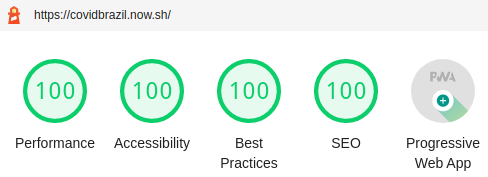

# Covidbrazil

Uma plataforma, que recebe, em tempo real, dados sobre casos epidemiológicos, tem o número de casos, mortes, recuperações, e informações novas sobre a doença. Com o objetivo de previnir o usuário.

---

## Android

## Linux

## Windows

## APIs

Mundo
https://covid19.mathdro.id/api

Brazil
https://covid19-brazil-api-docs.now.sh/

